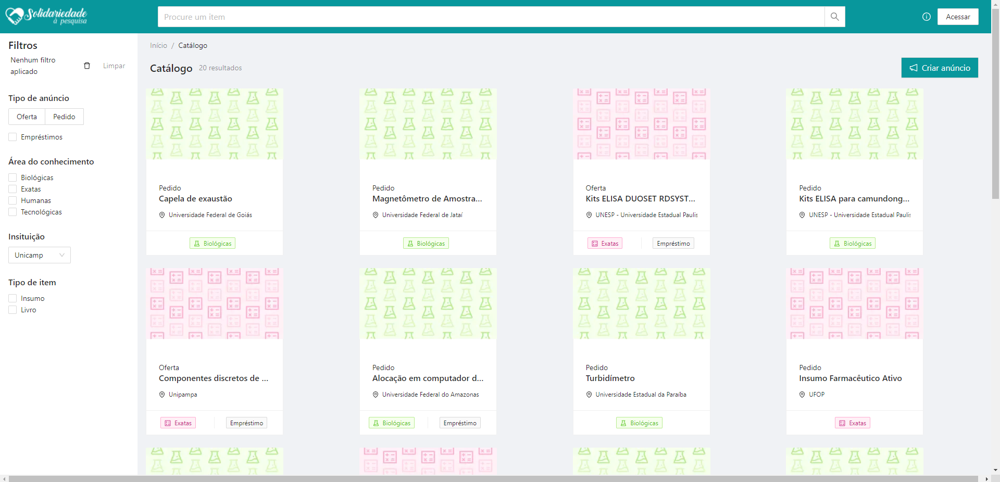

# Universidade Estadual de Campinas
# Instituto da Computação

## Disciplina: MC855-2s2021

## TIL-Troca de Insumos de Laboratórios (Front-end)

#### Professor e Assistente

| Nome                     | Email                   |
| ------------------------ | ------------------------|
| Professora Juliana Borin | jufborin [at] unicamp.br     |
| Assistente Paulo Kussler | paulo.kussler [at] gmail.com |


#### Equipe

| Nome               | RA               | Email                  | ID Git                |
| ------------------ | ---------------- | ---------------------- |---------------------- |
| Filipe Cavalheiro Marques |      148524            | f148524 [at] dac.unicamp.br                       |     @filipemarques33                  |
| João Victor Flores da Costa   |   199818               |      j199818 [at] dac.unicamp.br                  |    @JoaoFloresDev                   |
| Leandro Nascimento |      171855            |          l171855 [at] dac.unicamp.br              |       @leandrones                |
| Leonardo Yukio Koike |    201332              | l201332 [at] dac.unicamp.br                        |      @leokoike                 |
| Lucas Silva Lopes do Carmo |    202110              |         l202110 [at] dac.unicamp.br               |  @Locke23                     |

### Descrição do projeto:

Aplicação frontend Troca de Insumos de Laboratórios (TIL), um projeto da matéria mc855.
Prova de conceito para melhorias da plataforma ["Solidariedade à Pesquisa"](https://solidariedade.unicamp.br/home/), iniciativa da
Faculdade de Ciências Médicas (FCM) da Unicamp.


#### Prints das telas com descrição das funcionalidades. 

Abaixo estão imagens do projeto rodando:
- A tela inicial com dados sobre o funcionamento do site:


- O catalogo com todas as ordem disponíveis no site:


- O catalogo com os resultados de uma busca:


- O modal de criação de uma ordem:


- A tela de criação de uma ordem:


- Tela de detalhes de uma ordem:


## Developers Front-end
João Victor Flores da Costa   RA: 199818\
Lucas Silva Lopes do Carmo RA: 202110

## Developer UI/UX
Filipe Cavalheiro Marques RA: 148524

 Desenhos diponíveis no [Figma](figma.com/file/0D2tCsuX5576oFREHl7mTc/Troca-de-Insumos:-Solidariedade-Unicamp).


## Para executar o projeto

Primeiro instale todas as dependencias:
```bash
npm install
# or
yarn install
```
Para executar o pacote de desenvolvimento:
```bash
npm run dev
# or
yarn dev
```

Para executar o pacote de produção:

```bash
npm run build
#then
yarn start

# or
yarn build
#then
yarn start
```

Abra [http://localhost:3000](http://localhost:3000) com o navegador para ver o resultado.

Garanta que o servidor backend esteja em funcionamento.
Para mais informações sobre o backend consulte [API routes](https://github.com/mc855-TIL/TIL-api)

Você pode começar olhando para o arquivo `src/pages/index.tsx`. O projeto possui um fast refresh, então pode acompanhar as mudanças em tempo real.


## Aprenda sobre Next.js

Para saber mais sobre Next.js, olhe os seguintes recursos:

- [Next.js Documentation](https://nextjs.org/docs) - learn about Next.js features and API.
- [Learn Next.js](https://nextjs.org/learn) - an interactive Next.js tutorial.


## Próximos passos
Acreditamos que os próximos passos desse projeto esteja em:
- Subir a aplicação para um serviço de Cloud
- Melhorar o recurso de filtragem de ordens
- Desenvolver um sistema de autenticação ou integrar ao serviço de autenticação do utilizado pelo Solidariedade.
- Criar um fluxo de autenticação real para o usuário